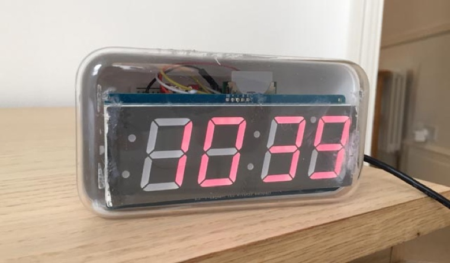
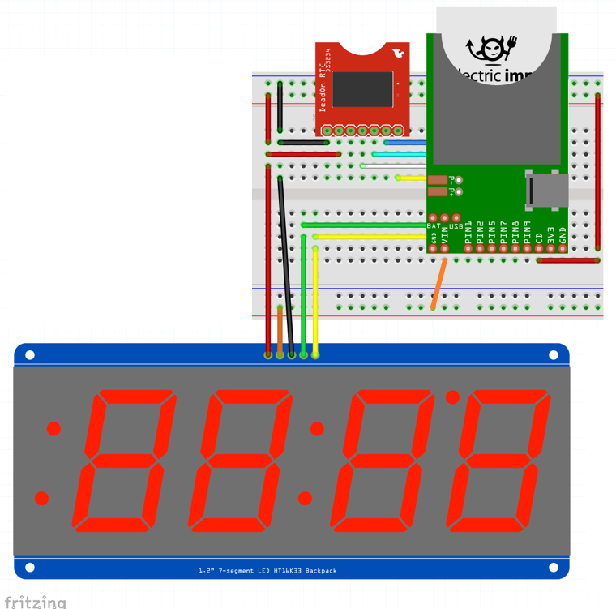
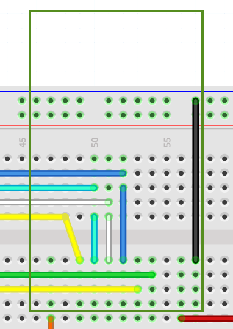
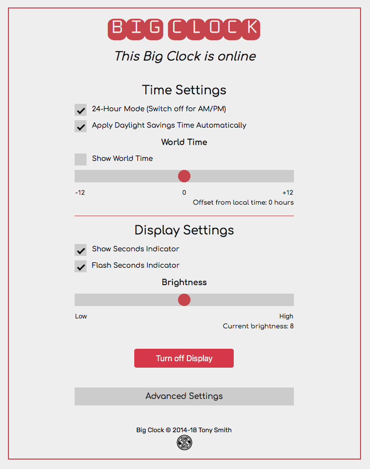

# BigClock 2.4.3 #

An Electric Imp-based wall/desktop clock which incorporates a large segment LED display and an RTC.



## Hardware ##

BigClock makes use of the following components:

- [Electric Imp Developer Kit (imp001 card and breakout board)](https://developer.electricimp.com/gettingstarted/devkits)
- [Adafruit 1.2-inch segment LED with I&sup2;C backpack](https://www.adafruit.com/products/1270)
- [SparkFun DeadOn RTC breakout board](https://www.sparkfun.com/products/10160)
- CR1225 coin cell battery for the RTC
- Seven connector pins for the RTC
- Breadboard
- Connector wiring
    - female-to-male wires for the display
    - male-to-maile wires for general wiring
- iPhone 5c retail packaging

### Assembly Instructions ###

1. Assemble the Electric Imp Developer Kit as per the [Electric Imp Getting Started Guide](https://developer.electricimp.com/docs/gettingstarted/developer/account)
1. Assemble the Adafruit display by soldering the segment LED and the supplied connector pins to the baseboard. You can read full instructions for this task [here](https://learn.adafruit.com/adafruit-led-backpack/1-2-inch-7-segment-backpack)
1. Assemble the DeadOn RTC breakout board by soldering the seven connector pins to the red board
1. Insert the CR1225 into the DeadOn
1. Add the above components to the breadboard using the following circuit:



The lower green and yellow wires are I&sup2;C &mdash; data and clock, respectively.

The orange wire provides the 5V (VIN) that the display requires, though its I&sup2;C pins run at 3V3 &mdash; hence the red connection to the imp breakout’s 3V3 pin.

Breakout pins 1, 2, 5 and 7 connect to the RTC via SPI.

The imp001 breakout board is mounted on top of some some of the wiring. The picture below shows the wiring with the breakout board removed:



When BigClock first runs, it takes the current time from the imp001 (itself set from the Electric Imp server) and programs this value into the DeadOn RTC. BigClock subsequently takes its time from the DeadOn, unless a reset is performed, in which case the DeadOn is reprogrammed from the imp001’s clock.


## Software ##

BigClock requires an Electric Imp developer account, which you should now have if you have followed the instructions in the [Electric Imp Getting Started Guide](https://developer.electricimp.com/gettingstarted/developer/account), referenced in Step 1 of the Hardware section, above.

Log into [Electric Imp impCentral](https://impcentral.electricimp.com/login/) and create a new Product and Device Group called **BigClock**. Now fill in the agent and device code with the relevant code from this repository.

In the device code, where you see the line

```
#import "ds3234rtc.class.nut"
```

**paste** in the contents of the file `ds3234rtc.class.nut` to **replace** this line.

And where you see the line

```
#import "HT16K33SegmentBig.class.nut"
```

**paste** in the contents of the file [`HT16K33SegmentBig.class.nut`](https://github.com/smittytone/HT16K33SegmentBig/blob/master/ht16k33segmentbig.class.nut) to **replace** this line.

Click on **Build and Force Restart** in the impCentral to transfer the code to your connected BigClock.

## Controlling Big Clock ##

BigClock is is controlled by a web app which you access at the its agent URL.

<p></p>

## Release Notes ##

- 2.4.3 *21 may 2020*
    - Update to JQuery 3.5.x.
    - Update to Bootstrap 4.5.x.
    - Update included repo names.
- 2.4.2 *18 December 2019*
    - Add [crash reporting](https://github.com/smittytone/generic)
    - Update dependencies: Bootstrap 4.3.1, JQuery 3.4.1
    - Initial work on supporting internal or external RTC
- 2.4.1 *17 December 2019*
    - Support Rocky 3.0.0.
- 2.4.0 *6 March 2019*
    - Refactor Web UI JavaScript
    - Update dependencies: Bootstrap 4.3.0, HT16K33SegmentBig 2.0.0, Rocky 2.0.2
- 2.3.0 *13 June 2018*
    - Update to [Bootstrap 4.1.1](https://getbootstrap.com/)
        - Update Web UI based on Bootstrap
        - Separate out Web UI into own file for clarity
    - Add support for [Location class 1.5.0](https://github.com/smittytone/Location)
    - Add support for [serial logging](https://github.com/smittytone/generic)
    - Update to [JQuery 3.3.1](https://jquery.com)
    - Prevent Ajax XHR caching
    - Add preliminary support for polite deployment

## Licence ##

The BigClock code and design is copyright &copy; 2014-2020 Tony Smith and licensed under the terms of the [MIT Licence](LICENSE).
