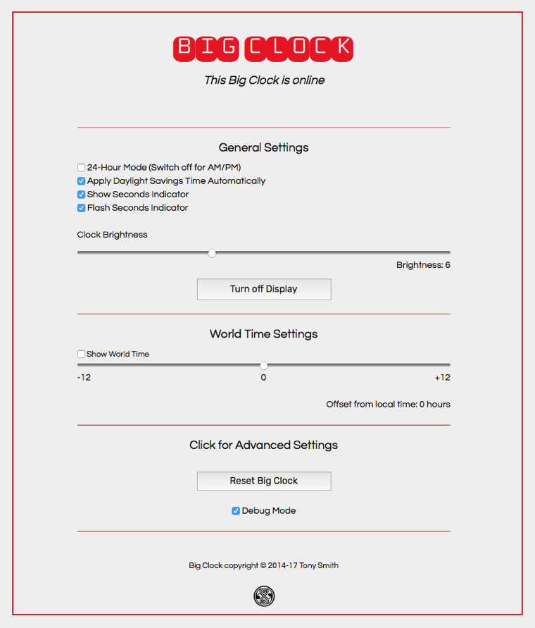

# BigClock 2.0

An Electric Imp-based wall/desktop clock which incorporates a large segment LED display and an RTC.


## Hardware

BigClock makes use of the following components:

- [Electric Imp Developer Kit (imp001 card and breakout board)](https://electricimp.com/docs/gettingstarted/devkits/)
- [Adafruit 1.2-inch segment LED with I&sup2;C backpack](https://www.adafruit.com/products/1270)
- [SparkFun DeadOn RTC breakout board](https://www.sparkfun.com/products/10160)
- CR1225 coin cell battery for the RTC
- Seven connector pins for the RTC
- Breadboard
- Connector wiring
    - female-to-male wires for the display
    - male-to-maile wires for general wiring

### Assembly Instructions

1. Assemble the Electric Imp Developer Kit as per the [Electric Imp Getting Started Guide](https://electricimp.com/docs/gettingstarted/developer/account/)
1. Assemble the Adafruit display by soldering the segment LED and the supplied connector pins to the baseboard. You can read full instructions for this task [here](https://learn.adafruit.com/adafruit-led-backpack/1-2-inch-7-segment-backpack)
1. Assemble the DeadOn RTC breakout board by soldering the seven connector pins to the red board
1. Insert the CR1225 into the DeadOn
1. Add the above components to the breadboard using the following circuit:


When BigClock first runs, it takes the current time from the imp001 (itself set from the Electric Imp server) and programs this value into the DeadOn RTC. BigClock subsequently takes its time from the DeadOn, unless a reset is performed, in which case the DeadOn is reprogrammed from the imp001’s clock.


## Software

BigClock requires an Electric Imp developer account, which you should now have if you have followed the instructions in the [Electric Imp Getting Started Guide](https://electricimp.com/docs/gettingstarted/developer/account/), referenced in Step 1 of the Hardware section, above.

Log into the [Electric Imp IDE](https://ide.electricimp.com/login/) (or make use of the [Build CLI command line tool](https://electricimp.com/docs/buildapi/buildcli/)) and create a new model called ‘BigClock’. Now fill in the agent and device code with the relevant code from this repository.

In the device code, where you see the line

```
#import "ds3234rtc.class.nut"
```

**paste** in the contents of the file `ds3234rtc.class.nut` to **replace** this line.

And where you see the line

```
#import "HT16K33SegmentBig.class.nut"
```

**paste** in the contents of the file `HT16K33SegmentBig.class.nut` to **replace** this line.

Click on ‘Build and Run’ in the IDE to transfer the model to your connected BigClock.

## Controlling Big Clock

BigClock is is controlled by a web app which you access at the its agent URL.



## Licence

The BigClock code and design is copyright 2014-2017 Tony Smith and licensed under the terms of the [MIT Licence](https://github.com/smittytone/BigClock/blob/master/LICENSE).
